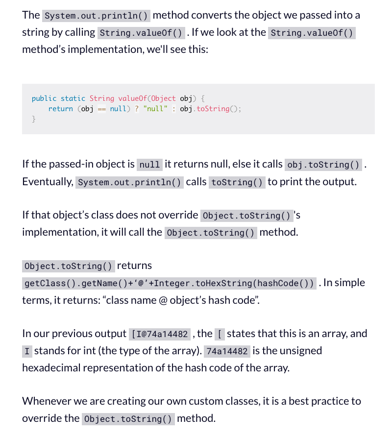

Notes from Baeldung's [Getting Started with Java](https://baeldung.com/get-started-with-java-series) series.

---

## Introduction

Java is a statically-typed, object-oriented, and platform-independent programming language created in 1995 by Oracle.

- Statically-typed: the type of a variable is known at compile time. This allows the compiler to catch any type error before the code is executed.
- Object-oriented: it models real-world objects. An object is a collection of data and methods that operate on its data.
- Platform-independent: Java programs can be written and compiled on one type of machine, such as a Windows system, and executed on another, such as MacOS, without any modification to the source code.

Getting Started with Java in VS Code: <https://code.visualstudio.com/docs/java/java-tutorial>.

You need:

- Java Development Kit (JDK)
- VSCode Java extension pack

## Basic Syntax in Java

Lorem.

### Data Types

The two broad categories types:

Primitive types: integer values (`int`, `long`, `byte`, `short`), floating point values (`float`, `double`), character values (`char`), and logical values (`boolean`).

| Data Type | Size   | Description                                               |
|-----------|--------|-----------------------------------------------------------|
| `byte`      | 1 byte | Stores whole numbers from -128 to 127.                      |
| `short`     | 2 bytes| Stores whole numbers from -32,768 to 32,767.               |
| `int`       | 4 bytes| Stores whole numbers from -2,147,483,648 to 2,147,483,647.|
| `long`      | 8 bytes| Stores whole numbers from -9,223,372,036,854,775,808 to 9,223,372,036,854,775,80. |
| `float`     | 4 bytes| Stores fractional numbers. Sufficient for storing 6 to 7 decimal digits (values from 3.4e−038 to 3.4e+038). |
| `double`    | 8 bytes| Stores fractional numbers. Sufficient for storing 15 decimal digits (values from 1.7e−308 to 1.7e+308).|
| `char`     | 2 bytes| Stores a single character/letter or ASCII values (values from '\u0000' (or 0) to '\uffff' (or 65,535 inclusive).     |
| `boolean`   | 1 bit  | Stores true or false values.  

Object/Reference types: `String`, `Integer`, `Double`, `Character`, `Boolean`, `Byte`, `Short`, `Long`, `Float`.

| Data Type | Description                                               |
|-----------|-----------------------------------------------------------|
| `String`      | Stores a sequence of characters. |
| `Integer`     | Stores whole numbers from -2,147,483,648 to 2,147,483,647. |
| `Double`      | Stores fractional numbers. Sufficient for storing 15 decimal digits (values from 1.7e−308 to 1.7e+308).|
| `Character`   | Stores a single character/letter or ASCII values (values from '\u0000' (or 0) to '\uffff' (or 65,535 inclusive)).     |
| `Boolean`     | Stores true or false values.
| `Byte`        | Stores whole numbers from -128 to 127.                      |
| `Short`       | Stores whole numbers from -32,768 to 32,767.               |
| `Long`        | Stores whole numbers from -9,223,372,036,854,775,808 to 9,223,372,036,854,775,80. |
| `Float`       | Stores fractional numbers. Sufficient for storing 6 to 7 decimal digits (values from 3.4e−038 to 3.4e+038).

> Primitive types are predefined (already defined) in Java.
> Non-primitive types are created by the programmer and is not defined by Java (except for String)

See [`snippets/data-types.java`](./snippets/data-types.java) for examples.

### Variables

To declare a variable, you must specify the type and name (identifier). An identifier must conform to the following rules:

- Starts with a letter, an underscore (_), or a dollar sign ($).
- Followed by any number of letters, digits, underscores, or dollar signs.
- Can’t be a reserved keyword.
- Can’t be true, false, or null.
- Can’t contain whitespace.

### Arrays

```java
int[] numbers = { 1, 2, 3, 4, 5 };
String[] names = { "John", "Doe" };
```

If you run `System.out.println()` on an array, you’ll get a hash code instead of the array values because arrays are objects in Java.

```java
System.out.println(numbers);
System.out.println(names);

// Output:
// [I@1b6d3586
// [Ljava.lang.String;@4554617c
```

See the explanation below from this [FCC tutorial](https://freecodecamp.org/news/java-array-methods-how-to-print-an-array-in-java/).



To print the actual values, you can use the `Arrays.toString()` method (or `Arrays.deepToString()` for nested arrays):

```java
System.out.println(Arrays.toString(numbers));
System.out.println(Arrays.toString(names));

// Output:
// [1, 2, 3, 4, 5]
// [John, Doe]
```

### Keywords

- `public`: the access modifier. It means that the method is visible and can be called from other objects of other types. Other alternatives are `private`, `protected`, `package` (default).
- `static`: means that the method is associated with the class, not a specific instance (object) of that class. This means that you can call a static method without creating an object of the class.
- `void`: the return type. It means that this method doesn’t return any value. You would use `int` for a method that returns an integer, for example.
- `main`: the name of the method. It’s the identifier that the JVM looks for as the starting point of the Java program.
- `class`: declare a class.
- `new`: create an instance of a class.
- `instanceof`: check if an object is an instance of a specific class or implements an interface.
- `String[] args`: the parameter passed to the main method. It’s an array of `String` objects, where the objects are command line arguments.

### Operators

Arithmetic:

- `+` (plus or addition)
- `-` (minus or subtraction)
- `*` (multiplication)
- `/`` (division)
- `%` (modulus or remainder)
- `++` (increment)
- `--` (decrement)

Logical:

- `&&` (logical and)
- `||` (logical or)
- `!` (logical not)

Comparison:

- `==` (equal to)
- `!=` (not equal to)
- `>` (greater than)
- `<` (less than)
- `>=` (greater than or equal to)
- `<=` (less than or equal to)

### Program Structure

A Java program is a collection of classes (blueprints or templates for creating objects) inside a file with `.java` extension. PS: the name of the file must match the name of the class.

For a Class to be executable, it must have a main method that signifies the entry point of the program.

```java
public class SimpleAddition {

    public static void main(String[] args) {
        int a = 10;
        int b = 5;
        double c = a + b;
        System.out.println( a + " + " + b + " = " + c);
    }
}
```

The `print()` method is similar to `println()`, except that it does not insert a new line at the end of the output.
